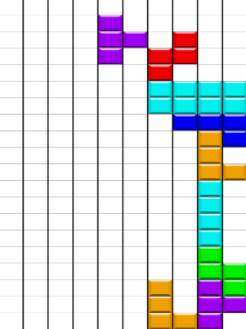

# royal-tetris
## Overview

This is a college were we implemented an online tetris.

The aim of this project is to have a few player playing tetris on the same grid.
We used java RMI to implement networking between the client and server

## Running the game

In order to launch the server: run 

Server.java in Server/src/main/java/game/tetris

## Issue
- We had trouble implementing the networking, so mid-development we rewrote the project from scratch and created a new branch named "rework"
- Since there are multiples block moving on the grid, it creates a lot of edges where for instance player can try to move on the same block at the same time

